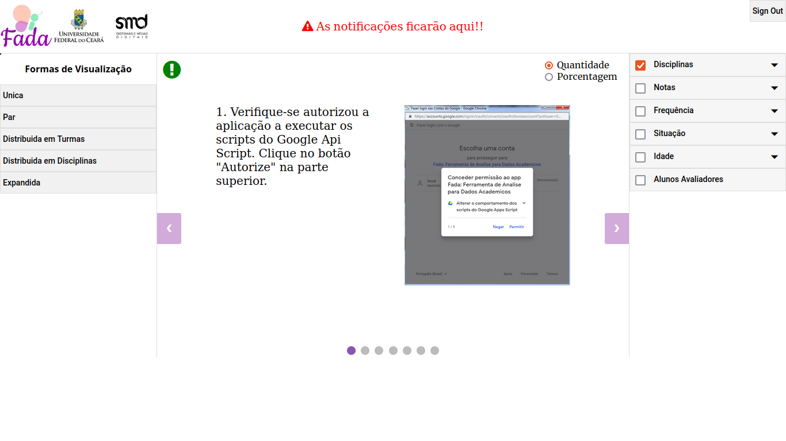

# FADA - Ferramenta para Analise de Dados Acadêmicos

A FADA possibilitou a visualização de dados por meio de diagramas de Venn, possibilitanto uma análise simples de informações acadêmicas (notas, frequência e reprovação), permitindo identificação de situações e apoio para tomada de decisão.

